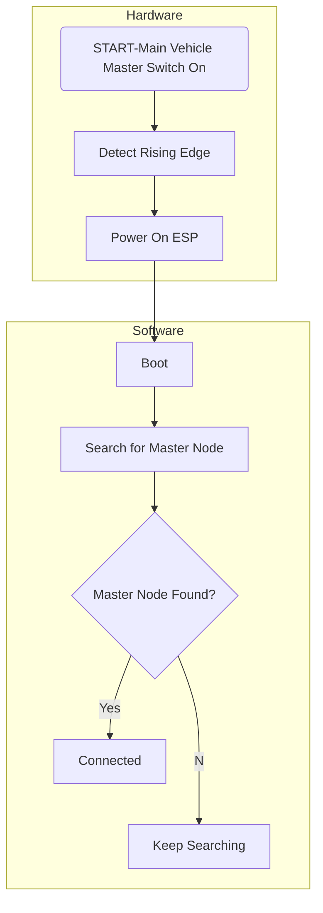

# EVPR Operation/Mode Diagram
Authors Note: The mode diagram was created using mermaid with the hopes that someday Github might support it. You can view currently using https://github.com/BackMarket/github-mermaid-extension. 

